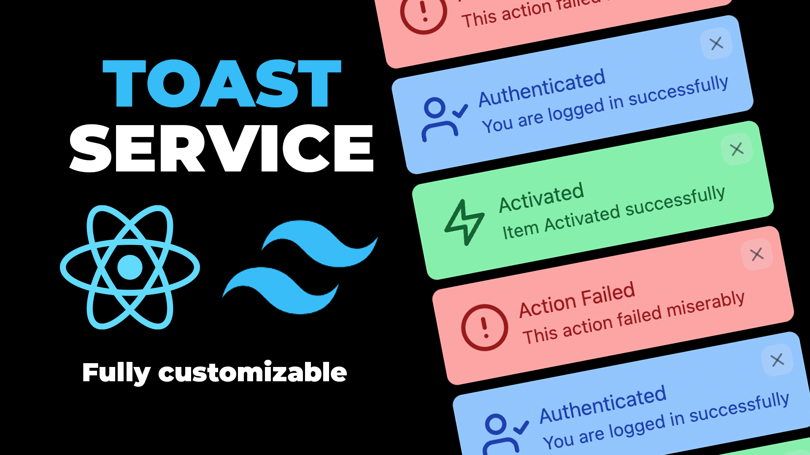

# Toast Notification Service purely in ReactJS and TailwindCSS | Build Toast Notification Service in ReactJS

The Toast Notification Service, exclusively developed with ReactJS and Tailwind CSS, provides a straightforward yet effective solution for incorporating toast notifications into React applications. This guide walks developers through the process of building a customizable notification service from scratch. By leveraging React's component-based architecture and Tailwind CSS's utility-first styling, developers can create a versatile and visually appealing toast notification system. The resulting Toast Notification Service enhances user experience by providing unobtrusive yet informative messages, creating a seamless integration for displaying notifications within React applications.

Youtube Tutorial Link: https://youtu.be/yX6rQwgrpEA

